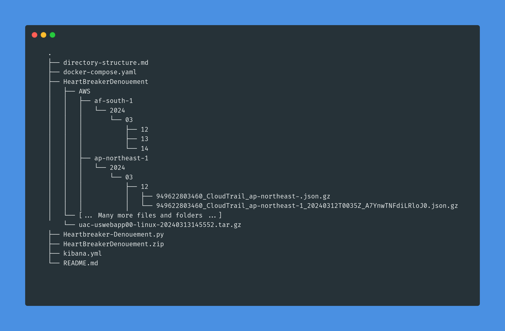

# Heartbreaker-Denouement (HTB - Sherlock) using ELK

This repository contains my script for parsing quickly the many Cloudtrail logs provided in the challenge [Heartbreaker-Denouement by HackTheBox](https://app.hackthebox.com/sherlocks/Heartbreaker-Denouement).

I'm using Elasticsearch and Python for its ease of use. None of this is particularly secure nor stable, it is not meant for production, only for solving the challenge on your PC.

It is made for linux (created on Ubuntu), **it shall not work on Windows**.

# Requirements

1. Docker, Docker engine
2. Python3, pip
3. Git

# Installation

### Setup 

1. Choose a working directory such as `/tmp/MySherlockFolder`
2. `git clone https://github.com/septdney/htb-sherlock-heartbreaker-denouement.git`
3. `$ cd htb-sherlock-heartbreaker-denouement`
4. `pip install elasticsearch`
5. Unzip the file `HeartBreakerDenouement.zip` directly into your working directory, such as now `/tmp/MySherlockFolder/htb-sherlock-heartbreaker-denouement`

### Tree

### Launch

1. `$ cd /tmp/MySherlockFolder/htb-sherlock-heartbreaker-denouement`
2. `$ docker compose up -d`
3. `$ python3 Heartbreaker-Denouement.py $PWD` 
4. Go to http://localhost:5601, create an dataview with the index `heartbreakerdenouement` and you should be good to go.

# Debugging

Feel free to open an issue.